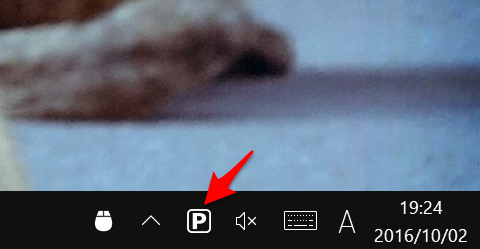

PreventSleep
====

PreventSleep.exe prevent your PC from automatically going to sleep, dimming the screen or starting screen savers.
This program was inspired by [Caffeine](http://lightheadsw.com/caffeine/).

Copyright and license
----
Copyright (c) 2016 yoggy

Released under the [MIT license](LICENSE.txt)
